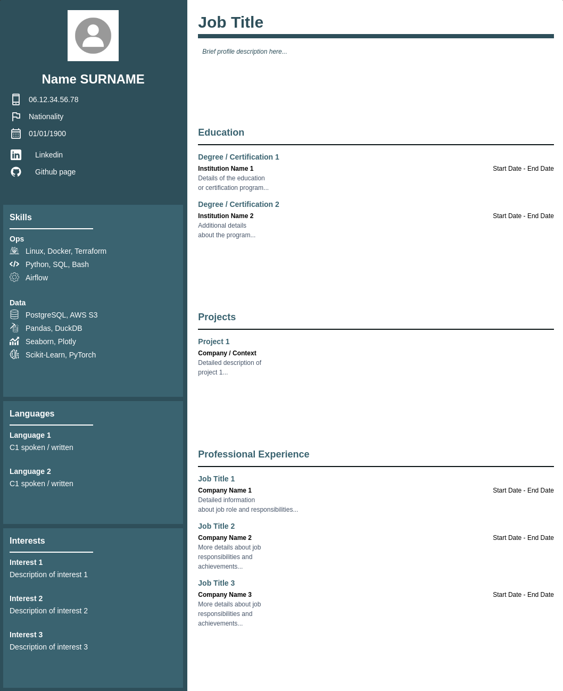
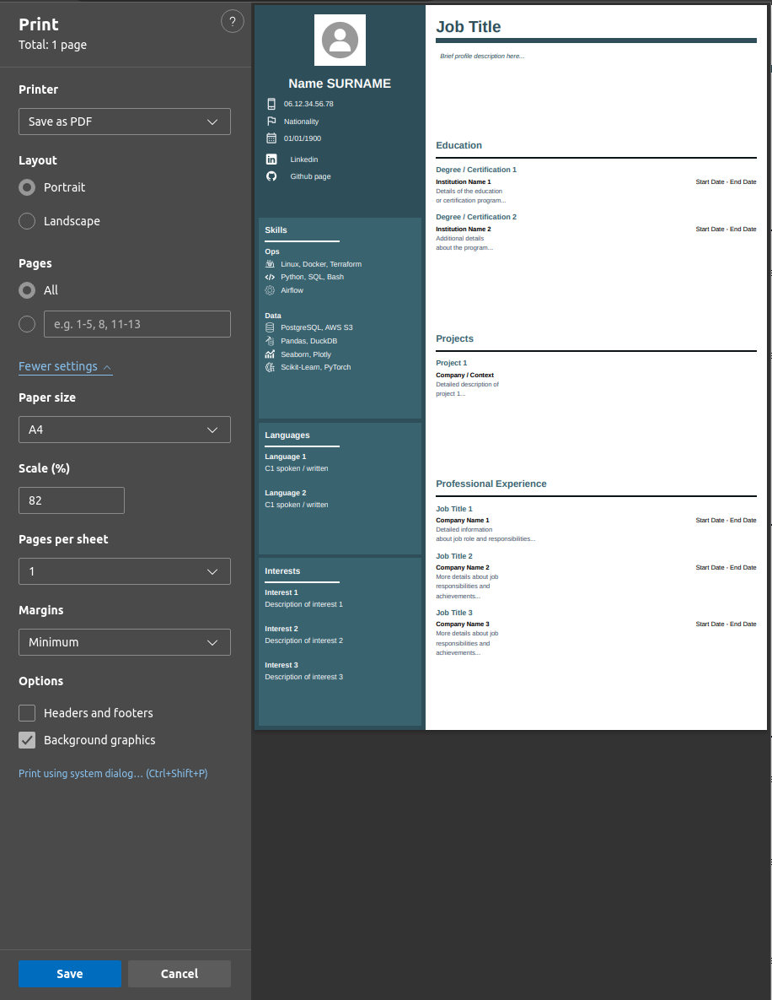

# TailwindCSS Résumé


A simple FastApi app to generate résumés from templates.  
<br>



## Table of Contents

- [TailwindCSS Résumé](#tailwindcss-résumé)
  - [Table of Contents](#table-of-contents)
  - [Features](#features)
  - [Installation](#installation)
    - [Steps](#steps)
  - [Usage](#usage)
    - [Running the Application](#running-the-application)
    - [Filling the résumé content in the YAML File](#filling-the-résumé-content-in-the-yaml-file)
    - [Customizing the Styling](#customizing-the-styling)
    - [Exporting to PDF](#exporting-to-pdf)

## Features

- Create multiple versions of resume content via yaml files
- Create multiple TailwindCSS layouts
- FastAPI app on dev mode for quick rendering
- Export resume to PDF with the browser's print function

## Installation


### Steps

1. **Clone the repository:**

    ```bash
    git clone https://github.com/MatthieuLeNozach/tailwindcss_resume.git
    cd tailwindcss_resume
    ```

2. **Install dependencies using Poetry:**

    ```bash
    poetry install

    # Or manual install via `pip`
    pip install {packages listed in `pyproject.toml`}  
    ```


3. **Activate the virtual environment:**

    ```bash
    poetry shell
    ```

4. **Check for tailwindCSS activation**:
    
    ```bash
    tailwind 
    ```
    - *pytailwindcss* allows to use TailwindCSS without installing it via `npm` 
    - *TailwindCSS* will run as subprocess when the FastAPI server is launched, no further action required


## Usage

### Running the Application

1. **Start the FastAPI server:**

    ```bash
    fastapi dev main.py

    # Or
    
    uvicorn app.main:app --reload
    ```

2. **Open your browser and navigate to:**

    ```
    http://127.0.0.1:8000
    ```


### Filling the résumé content in the YAML File

1. Open the `resume-content.example.yml` file located in the `app` directory.
2. Choose the styling: `tailwind_style: "example-style"`, base is `bismarck` but see below for further customisations
3. Fill in your personal information, skills, experience, education, and other sections as needed.

    ```yaml
    description:
      name: "Your Job Title"
      version: "1"
      tailwind_style: "example-style"

    sidebar:
      contact:
        name: "Name SURNAME"
        picture: "static/images/profile.example.jpg"
        personal_info:
          phone: 
            number: "06.12.34.56.78"
            icon: "static/images/icons/phone.svg"
          nationality:
            title: "Nationality"
            icon: "static/images/icons/flag.svg"
          born: 
            date: "01/01/1900"
            icon: "static/images/icons/calendar.svg"
            ...
        ...
    ```

### Customizing the Styling


1. **Navigate to the `app/static/src` directory:**

    `bismarck.css` contains the styles for the default `bismarck` theme. Duplicate and rename this file to work on a new styling.


2. **Modify the CSS classes:**
    
    Watch how HTML classes link to the CSS file and modify accordingly.

    **HTML Example:**

    ```html
    <div class="profile-section">
        <h1 class="profile-title">{{ resume.main_content.profile.title }}</h1>
        <div class="profile-title-bar"></div>
        <div class="profile-content">{{ resume.main_content.profile.content | replace('\n', '<br>') | safe }}</div>
    </div>
    ```

    **CSS Example (`bismarck.css`):**

    ```css
    .profile-section {
        @apply bg-white rounded-none p-2 flex-grow mb-0;
    }

    .profile-title {
        @apply text-bismarck-700 text-3xl font-semibold mb-0;
    }

    .profile-title-bar {
        @apply bg-bismarck-700 h-1 w-full mb-1;
    }


    .profile-content {
        @apply flex-grow bg-white text-bismarck-700 text-xs italic leading-relaxed p-1;
        max-height: 150px;
        overflow-y: auto;
    }
    ```

3. **Customize further by modifying `tailwind.config.js`:**


    **Adding a New Color Palette:**

    ```javascript
    theme: {
        extend: {
            colors: {
                'bismarck': {
                100: '#73c5e0',
                200: '#68b1ca',
                300: '#5c9eb3',
                400: '#518a9d',
                500: '#457686',
                600: '#3a6370',
                700: '#2e4f5a',
                800: '#223b43',
                900: '#17272d',
                950: '#0b1416'},
    ...
    ```

    **Adding new fonts:**

    ```javascript
    theme: {
        extend: {
            fontFamily: {
                sans: ['Poppins', 'sans-serif'],
                serif: ['Lora', 'serif'],
    ...
    ```
    You still need to **import** the font in your CSS input file, ex importing *Poppins* font:
    ```css
    
    @import url('https://fonts.googleapis.com/css2?family=Poppins:ital,wght@0,100;0,200;0,300;0,400;0,500;0,600;0,700;0,800;0,900;1,100;1,200;1,300;1,400;1,500;1,600;1,700;1,800;1,900&display=swap');
    ```


### Exporting to PDF

1. **Use the print function of your browser:**

    - Open the resume in your browser.
    - Press `Ctrl + P` (Windows/Linux) or `Cmd + P` (Mac).
    - Choose "Save as PDF" as the destination.

    